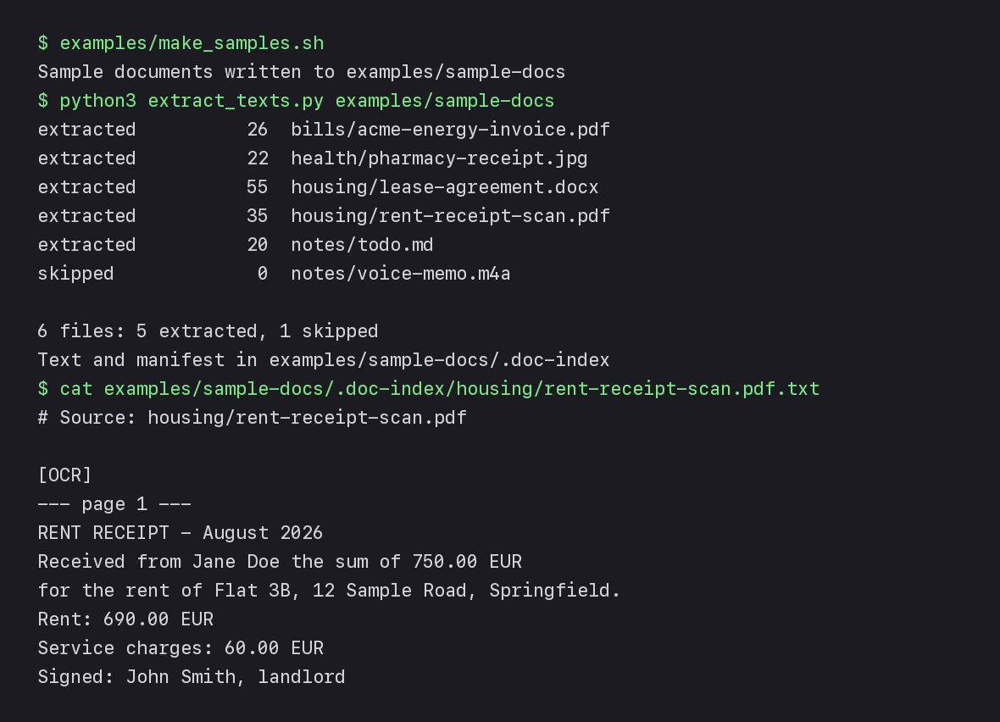
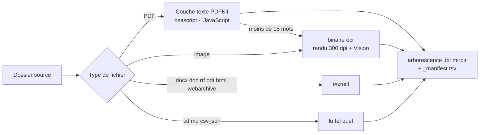

# doc-indexer-macos

[](https://github.com/Bouliw/doc-indexer-macos/actions/workflows/tests.yml)

[English version](README.md)

OCR et extraction de texte en local pour un dossier de papiers administratifs, sur macOS. Donnez-lui des PDF scannés, des fichiers Word et des photos de reçus prises au téléphone : il en tire un fichier texte recherchable par document, plus un manifeste, prêts pour `grep` ou pour un agent IA. L'OCR tourne sur la machine avec Apple Vision, donc rien ne sort du Mac.



- **Tout reste en local** : l'OCR se fait sur la machine et les fichiers d'origine ne sont jamais modifiés.
- **Aucune dépendance** : la bibliothèque standard de Python et des frameworks fournis avec macOS.
- **Incrémental** : une nouvelle exécution ne traite que ce qui a changé.
- **Prêt pour les agents IA** : du texte brut et un manifeste TSV que n'importe quel outil, ou n'importe quel LLM, sait lire.

## Le problème

Les papiers administratifs mélangent les formats : des PDF avec une couche texte, des scans qui n'en ont pas, et beaucoup de photos prises au téléphone. Pour y chercher quelque chose, ou poser à un agent IA des questions comme « quelle facture reste à payer ? » sur l'ensemble, il faut d'abord en tirer du texte. Deux contraintes : n'envoyer aucune pièce d'identité ni aucun relevé bancaire à un service d'OCR dans le cloud, et ne jamais modifier les originaux. Les outils d'OCR existants obligeaient à installer Tesseract ou à envoyer les fichiers en ligne ; le pipeline repose donc sur ce que macOS fournit déjà.

Testé sur de vrais dossiers mêlant PDF texte, scans, photos prises au téléphone et fichiers Word.

## Ce que fait l'outil

- Parcourt un dossier et ses sous-dossiers, et écrit un `.txt` par document dans une arborescence miroir (par défaut `SOURCE/.doc-index`).
- Choisit l'extracteur d'après le type de fichier :

  | Fichiers | Extracteur |
  |---|---|
  | PDF avec une couche texte | PDFKit, appelé via JavaScript for Automation, plus les valeurs saisies dans ses champs de formulaire |
  | PDF scanné (moins de 15 mots de texte) | binaire `ocr` : chaque page est rendue à 300 dpi, puis lue par Apple Vision |
  | Images : png, jpg, heic, tiff, webp, gif | binaire `ocr` (Apple Vision), sur toutes les pages d'un TIFF multipage |
  | docx, doc, rtf, odt, et pages web enregistrées en html ou webarchive | `textutil`, qui ne charge jamais les images ni les styles distants d'une page |
  | txt, md, csv, json | lus tels quels, en UTF-8, UTF-16 ou Windows-1252 (exports bancaires et Excel) |
  | Audio et vidéo (mp3, m4a, mp4, mov) et extraits web (.textclipping) | ignorés |

- Incrémental : chaque `.txt` garde la date de modification de son document, et un fichier est retraité dès que cette date change, même si elle recule (un document remplacé par une copie antérieure). `--force` refait tout.
- Supprime le texte d'un document effacé ou renommé depuis la dernière exécution, pour que rien dans la sortie ne décrive un fichier qui n'existe plus.
- Écrit `_manifest.tsv`, avec une ligne par fichier : chemin, type, taille, date, statut et nombre de mots (ceux du document lui-même, sans l'en-tête ni les marqueurs de page de l'OCR). Un statut `empty (check)` signale un document à ouvrir à la main, le plus souvent une photo ratée.
- N'écrit jamais dans le dossier source, sauf dans le dossier de sortie lui-même si vous gardez l'emplacement par défaut. Le dossier de sortie ne peut être ni le dossier source, ni un dossier qui le contient. Un dossier de sortie qui existe déjà n'est accepté que s'il est vide ou contient le manifeste d'une exécution précédente, et seuls les textes listés dans ce manifeste peuvent être supprimés.

L'extraction elle-même n'utilise aucun modèle de langage. L'IA intervient après : n'importe quel agent IA peut lire le manifeste et les fichiers texte, tenir un index des documents (catégorie, date, échéance) et répondre aux questions posées dessus.

## Prérequis

- macOS (testé sous macOS 26, sur Apple silicon)
- Python 3.9 ou plus récent, bibliothèque standard uniquement (le `python3` des Xcode Command Line Tools suffit)
- Les Xcode Command Line Tools pour `swiftc` : `xcode-select --install`

## Installation

```bash
git clone https://github.com/Bouliw/doc-indexer-macos.git
cd doc-indexer-macos
swiftc -O ocr.swift -o ocr
```

## Utilisation

```bash
python3 extract_texts.py ~/Documents/Paperwork                       # sortie dans ~/Documents/Paperwork/.doc-index
python3 extract_texts.py ~/Documents/Paperwork --out ~/paperwork-txt # sortie ailleurs
python3 extract_texts.py ~/Documents/Paperwork --force               # tout ré-extraire
```

Par défaut, l'OCR lit l'anglais puis le français. Pour changer de langues, passez-les dans `OCR_LANGUAGES`, par ordre de priorité :

```bash
OCR_LANGUAGES=de-DE,en-US python3 extract_texts.py ~/Documents/Paperwork
```

Si le binaire `ocr` n'est pas à côté du script, indiquez son chemin avec `DOC_INDEXER_OCR=/path/to/ocr`.

Le dossier de sortie et ses fichiers ne sont lisibles que par votre compte (dossiers en 0700, fichiers en 0600). Ils restent une copie en texte brut de vos documents : si le dossier source est dans iCloud Drive (Bureau et Documents compris) ou sauvegardé par Time Machine, le dossier de sortie par défaut part avec lui. Pour l'éviter, passez par `--out` vers un dossier hors d'iCloud, et excluez-le des sauvegardes avec `tmutil addexclusion`.

Statuts du manifeste :

| Statut | Signification |
|---|---|
| `extracted` | texte écrit pendant cette exécution |
| `up to date` | inchangé depuis la dernière exécution, pas retraité |
| `empty (check)` | l'extraction a donné trois mots ou moins : ouvrez le fichier pour vérifier |
| `skipped` | audio, vidéo ou extrait web, non indexé |
| `unsupported` | aucun extracteur pour ce type de fichier |
| `error: <Exception>` | l'extracteur a échoué sur ce fichier (`NoOCRBinary` : compilez d'abord `ocr`) ; l'exécution continue et le fichier sera retenté la fois suivante |

## Tester sur des documents fictifs

`examples/make_samples.sh` crée un petit dossier de faux papiers avec des outils fournis par macOS : une facture d'énergie en PDF avec couche texte, une quittance de loyer scannée, la photo d'un ticket de pharmacie, un bail au format Word, une note et un mémo vocal.

```bash
examples/make_samples.sh
python3 extract_texts.py examples/sample-docs
cat examples/sample-docs/.doc-index/housing/rent-receipt-scan.pdf.txt
```

```
extracted          26  bills/acme-energy-invoice.pdf
extracted          22  health/pharmacy-receipt.jpg
extracted          55  housing/lease-agreement.docx
extracted          35  housing/rent-receipt-scan.pdf
extracted          20  notes/todo.md
skipped             0  notes/voice-memo.m4a

6 files: 5 extracted, 1 skipped
Text and manifest in examples/sample-docs/.doc-index
```

Lancé une deuxième fois, le script renvoie `up to date` pour chaque document extrait (le mémo vocal reste `skipped`).

## Architecture



| Fichier | Rôle |
|---|---|
| `extract_texts.py` | Parcourt le dossier, envoie chaque fichier au bon extracteur, écrit les fichiers texte et le manifeste |
| `ocr.swift` | Petit outil en ligne de commande : reconnaissance de texte Vision sur les images, et sur les PDF page par page |
| `examples/make_samples.sh` | Génère les documents fictifs de la démo |

Choix de conception :

- **Rien d'autre que ce que macOS fournit.** Ni Tesseract, ni poppler, ni pip install. L'OCR tourne sur la machine, ce qui compte quand on traite des pièces d'identité et des relevés bancaires.
- **PDFKit via JavaScript for Automation** (`osascript -l JavaScript`). Python récupère la couche texte d'un PDF sans PyObjC ni aucun autre paquet.
- **Un binaire Swift à part pour Vision.** Vision n'a pas d'API Python ; un outil Swift d'environ 90 lignes, compilé une fois, reste plus simple qu'une passerelle.
- **Du texte brut et du TSV en sortie.** N'importe quel outil sait les lire, y compris un agent IA incapable d'ouvrir un scan.

## Limites

- macOS uniquement.
- Un PDF qui mêle une courte couche texte et des pages scannées (15 mots de texte ou plus) n'est pas envoyé à l'OCR.
- L'écriture manuscrite et les photos de mauvaise qualité donnent un texte partiel : regardez les lignes `empty (check)` et les nombres de mots.
- Les fichiers `.pages` ne sont pas pris en charge.
- Les liens symboliques, vers des dossiers ou vers des fichiers, ne sont pas suivis, car ils pourraient mener hors du dossier à indexer ; un avertissement signale chacun d'eux, comme chaque dossier qui ne peut pas être lu.

## Tests

```bash
swiftc -O ocr.swift -o ocr
python3 -m unittest discover -s tests -v
```

Les tests génèrent les documents fictifs, puis vérifient chaque statut, l'OCR de chaque page d'un scan ou d'un TIFF multipage et celui des images transparentes, les valeurs des champs de formulaire (sans les cases à cocher), les fichiers texte en Windows-1252 et en UTF-16, la lecture des pages web enregistrées sans une seule requête réseau, les signalements maintenus d'une exécution à l'autre, les fichiers retentés après une erreur ou tant que le binaire OCR manque, un document remplacé par une copie plus ancienne, le nettoyage après un renommage ou une suppression (et l'absence de nettoyage quand un dossier est illisible), et des originaux laissés intacts. Une seconde série n'utilise que des fichiers texte : les fichiers personnels laissés intacts dans le dossier de sortie, des textes lisibles par leur seul propriétaire, les liens vers des fichiers non suivis, et les noms de fichiers débarrassés des caractères de contrôle dans les avertissements. GitHub Actions lance l'ensemble sur un Mac à chaque push.

## Licence

MIT, voir [LICENSE](LICENSE).
