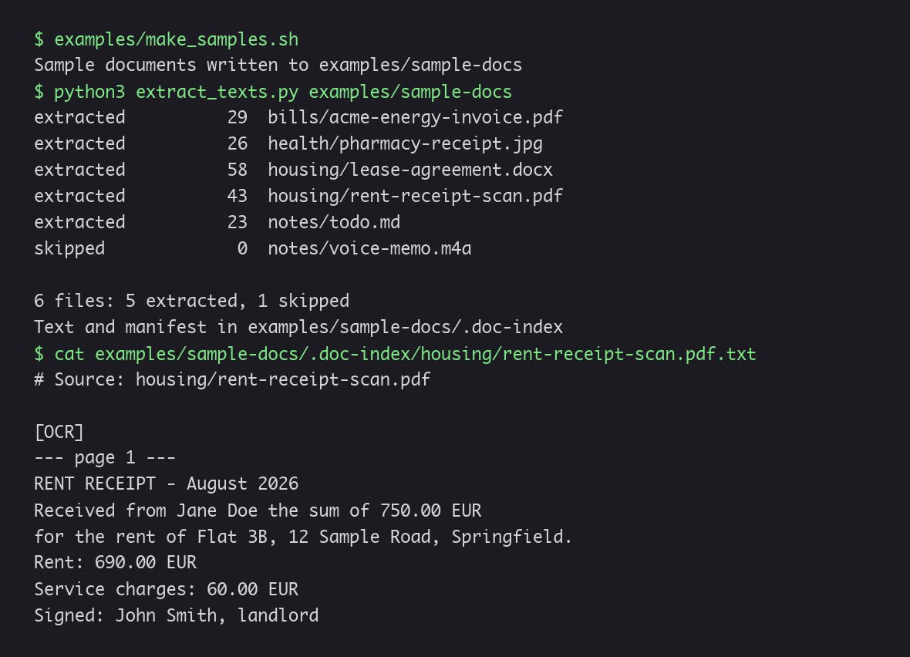
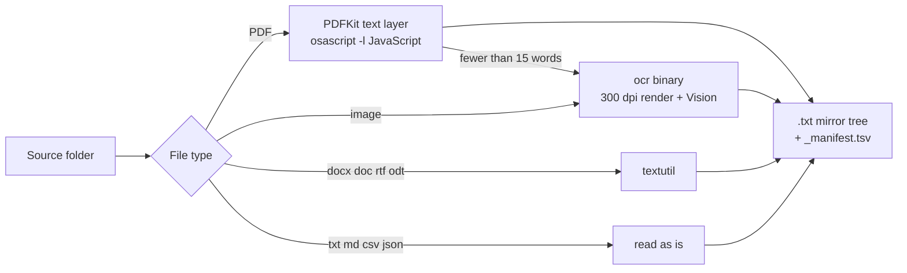

# doc-indexer-macos

Private OCR and text extraction for a folder of paperwork, on macOS. Point it at scanned PDFs, Word files and phone photos of receipts: you get one searchable text file per document plus a manifest, ready for `grep` or an AI agent. OCR runs on-device with Apple Vision, so nothing leaves the Mac.



- **Private by design**: on-device OCR, and the original files are never modified.
- **Zero dependencies**: Python standard library and frameworks that ship with macOS.
- **Incremental**: a new run only processes what changed.
- **Agent-ready**: plain text and a TSV manifest that any tool, or any LLM, can read.

## The problem

My admin paperwork is a mix of formats: PDFs with a text layer, scans with none, and a lot of phone photos. I wanted to ask an AI agent questions like "when does my lease end?" or "which bill is still unpaid?" across all of it. Two constraints: no identity paper or bank statement sent to a cloud OCR service, and the originals never modified. Existing OCR tools meant installing Tesseract or uploading files, so I built a pipeline on what macOS already ships.

It runs on my own paperwork: 87 files (59 PDFs, 23 photos and scans, 4 Word files), 86 of them turned into searchable text. The last one is a web clipping, skipped on purpose.

## What it does

- Walks a folder recursively and writes one `.txt` per document into a mirror tree (by default `SOURCE/.doc-index`).
- Picks the extractor from the file type:

  | Files | Extractor |
  |---|---|
  | PDF with a text layer | PDFKit, called through JavaScript for Automation |
  | Scanned PDF (fewer than 15 words of text) | `ocr` binary: every page rendered at 300 dpi, then Apple Vision |
  | Images: png, jpg, heic, tiff, webp, gif | `ocr` binary (Apple Vision) |
  | docx, doc, rtf, odt | `textutil` |
  | txt, md, csv, json | read as is |
  | Audio and video | skipped |

- Incremental: a file is processed again only if it changed since its `.txt` was written. `--force` redoes everything.
- Writes `_manifest.tsv` with one line per file: path, type, size, date, status and word count. An `empty (check)` status points to a document worth opening by hand, usually a bad photo.
- Never writes into the source folder, except the output folder itself when you keep the default location.

The extraction itself uses no language model. The AI part comes after: in my workflow, Claude Code reads the manifest and the text files, keeps an index of my documents (category, date, deadline) and answers questions about them.

## Requirements

- macOS (tested on macOS 26, Apple silicon)
- Python 3.9 or later, standard library only (the `python3` from the Xcode Command Line Tools is enough)
- Xcode Command Line Tools for `swiftc`: `xcode-select --install`

## Install

```bash
git clone https://github.com/Bouliw/doc-indexer-macos.git
cd doc-indexer-macos
swiftc -O ocr.swift -o ocr
```

## Usage

```bash
python3 extract_texts.py ~/Documents/Paperwork                       # output in ~/Documents/Paperwork/.doc-index
python3 extract_texts.py ~/Documents/Paperwork --out ~/paperwork-txt # output elsewhere
python3 extract_texts.py ~/Documents/Paperwork --force               # re-extract every file
```

OCR languages default to English then French. Change them with `OCR_LANGUAGES`, in priority order:

```bash
OCR_LANGUAGES=de-DE,en-US python3 extract_texts.py ~/Documents/Paperwork
```

If the `ocr` binary is not next to the script, point to it with `DOC_INDEXER_OCR=/path/to/ocr`.

Statuses in the manifest:

| Status | Meaning |
|---|---|
| `extracted` | text written during this run |
| `up to date` | unchanged since the last run, not processed again |
| `empty (check)` | three words or fewer came out: open the file and check it |
| `skipped` | audio or video, not indexed |
| `unsupported` | no extractor for this file type |
| `error: <Exception>` | the extractor failed on this file; the run goes on |

## Try it on fictitious documents

`examples/make_samples.sh` builds a small folder of fake paperwork with tools that ship with macOS: an energy bill as a text PDF, a scanned rent receipt, a photo of a pharmacy receipt, a lease in Word, a note and a voice memo.

```bash
examples/make_samples.sh
python3 extract_texts.py examples/sample-docs
cat examples/sample-docs/.doc-index/housing/rent-receipt-scan.pdf.txt
```

```
extracted          29  bills/acme-energy-invoice.pdf
extracted          26  health/pharmacy-receipt.jpg
extracted          58  housing/lease-agreement.docx
extracted          43  housing/rent-receipt-scan.pdf
extracted          23  notes/todo.md
skipped             0  notes/voice-memo.m4a

6 files: 5 extracted, 1 skipped
Text and manifest in examples/sample-docs/.doc-index
```

Run it a second time and every document comes back `up to date`.

## Architecture



| File | Role |
|---|---|
| `extract_texts.py` | Walks the folder, dispatches each file, writes the text files and the manifest |
| `ocr.swift` | Small command-line tool: Vision text recognition on images, and on PDFs page by page |
| `examples/make_samples.sh` | Generates the fictitious demo documents |

Design decisions:

- **macOS built-ins only.** No Tesseract, no poppler, no pip install. The OCR runs on-device, which matters for identity papers and bank statements.
- **PDFKit through JavaScript for Automation** (`osascript -l JavaScript`). Python gets the text layer of a PDF without PyObjC or any other package.
- **A separate Swift binary for Vision.** Vision has no Python API; a 50-line Swift tool compiled once is simpler than a bridge.
- **Plain text and TSV as output.** Any tool can read them, including an AI agent that cannot open a scan.

## Limitations

- macOS only.
- A PDF that mixes a short text layer with scanned pages (15 words or more of text) is not sent to OCR.
- Handwriting and low-quality photos give partial text: look at the `empty (check)` lines and the word counts.
- `.pages` files are not supported.

## How I built it

I designed the pipeline under strict, targeted requirements: local only, no dependencies, originals never touched, one text file per document. I tested every version against my real documents and made the calls on what to change. One example: scanned PDFs were first read from a single low-resolution page; I switched to OCR on every page, rendered at 300 dpi.

## License

MIT, see [LICENSE](LICENSE).
