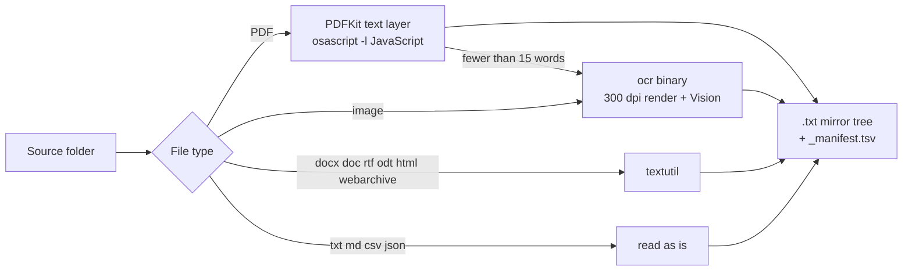

# doc-indexer-macos

[](https://github.com/Bouliw/doc-indexer-macos/actions/workflows/tests.yml)

[Version française](README.fr.md)

Private OCR and text extraction for a folder of paperwork, on macOS. Point it at scanned PDFs, Word files and phone photos of receipts: you get one searchable text file per document plus a manifest, ready for `grep` or an AI agent. OCR runs on-device with Apple Vision, so nothing leaves the Mac.


- **Private by design**: on-device OCR, and the original files are never modified.
- **Zero dependencies**: Python standard library and frameworks that ship with macOS.
- **Incremental**: a new run only processes what changed.
- **Agent-ready**: plain text and a TSV manifest that any tool, or any LLM, can read.

## The problem

Admin paperwork is a mix of formats: PDFs with a text layer, scans with none, and a lot of phone photos. Before you can search it, or ask an AI agent questions like "which bill is still unpaid?" across all of it, it has to become text. Two constraints: no identity paper or bank statement sent to a cloud OCR service, and the originals never modified. Existing OCR tools meant installing Tesseract or uploading files, so the pipeline is built on what macOS already ships.

Tested on real-world mixes of text PDFs, scans, phone photos and Word files.

## What it does

- Walks a folder recursively and writes one `.txt` per document into a mirror tree (by default `SOURCE/.doc-index`).
- Picks the extractor from the file type:

  | Files | Extractor |
  |---|---|
  | PDF with a text layer | PDFKit, called through JavaScript for Automation, plus the values typed into its form fields |
  | Scanned PDF (fewer than 15 words of text) | `ocr` binary: every page rendered at 300 dpi, then Apple Vision |
  | Images: png, jpg, heic, tiff, webp, gif | `ocr` binary (Apple Vision), every page of a multi-page TIFF |
  | docx, doc, rtf, odt, and web pages saved as html or webarchive | `textutil`, which never loads a page's remote images or styles |
  | txt, md, csv, json | read as is, in UTF-8, UTF-16 or Windows-1252 (bank and Excel exports) |
  | Audio and video (mp3, m4a, mp4, mov) and web clippings (.textclipping) | skipped |

- Incremental: each `.txt` keeps the modification date of its document, and a file is processed again as soon as that date changes, even to an older one (a document replaced by an earlier copy). `--force` redoes everything.
- Removes the text of a document deleted or renamed since the last run, so nothing in the output describes a file that is gone.
- Writes `_manifest.tsv` with one line per file: path, type, size, date, status and word count (words of the document itself, without the header and OCR page markers). An `empty (check)` status points to a document worth opening by hand, usually a bad photo.
- Never writes into the source folder, except the output folder itself when you keep the default location. The output folder cannot be the source folder or contain it. An existing output folder is accepted only if it is empty or holds the manifest of a previous run, and only the texts listed in that manifest are ever removed.

The extraction itself uses no language model. The AI part comes after: any AI agent can read the manifest and the text files, keep an index of the documents (category, date, deadline) and answer questions about them.

## Requirements

- macOS (tested on macOS 26, Apple silicon)
- Python 3.9 or later, standard library only (the `python3` from the Xcode Command Line Tools is enough)
- Xcode Command Line Tools for `swiftc`: `xcode-select --install`

## Install

```bash
git clone https://github.com/Bouliw/doc-indexer-macos.git
cd doc-indexer-macos
swiftc -O ocr.swift -o ocr
```

## Usage

```bash
python3 extract_texts.py ~/Documents/Paperwork                       # output in ~/Documents/Paperwork/.doc-index
python3 extract_texts.py ~/Documents/Paperwork --out ~/paperwork-txt # output elsewhere
python3 extract_texts.py ~/Documents/Paperwork --force               # re-extract every file
```

OCR languages default to English then French. Change them with `OCR_LANGUAGES`, in priority order:

```bash
OCR_LANGUAGES=de-DE,en-US python3 extract_texts.py ~/Documents/Paperwork
```

If the `ocr` binary is not next to the script, point to it with `DOC_INDEXER_OCR=/path/to/ocr`.

The output folder and its files are readable by your account only (folders 0700, files 0600). They are still a plain-text copy of your documents: if the source folder sits in iCloud Drive (Desktop and Documents included) or is backed up by Time Machine, the default output folder goes along. To avoid that, use `--out` with a folder outside iCloud, and exclude it from backups with `tmutil addexclusion`.

Statuses in the manifest:

| Status | Meaning |
|---|---|
| `extracted` | text written during this run |
| `up to date` | unchanged since the last run, not processed again |
| `empty (check)` | three words or fewer came out: open the file and check it |
| `skipped` | audio, video or web clipping, not indexed |
| `unsupported` | no extractor for this file type |
| `error: <Exception>` | the extractor failed on this file (`NoOCRBinary`: build `ocr` first); the run goes on, and the file is tried again next time |

## Try it on fictitious documents

`examples/make_samples.sh` builds a small folder of fake paperwork with tools that ship with macOS: an energy bill as a text PDF, a scanned rent receipt, a photo of a pharmacy receipt, a lease in Word, a note and a voice memo.

```bash
examples/make_samples.sh
python3 extract_texts.py examples/sample-docs
cat examples/sample-docs/.doc-index/housing/rent-receipt-scan.pdf.txt
```

```
extracted          26  bills/acme-energy-invoice.pdf
extracted          22  health/pharmacy-receipt.jpg
extracted          55  housing/lease-agreement.docx
extracted          35  housing/rent-receipt-scan.pdf
extracted          20  notes/todo.md
skipped             0  notes/voice-memo.m4a

6 files: 5 extracted, 1 skipped
Text and manifest in examples/sample-docs/.doc-index
```

Run it a second time and every extracted document comes back `up to date` (the voice memo stays `skipped`).

## Architecture


```mermaid
flowchart LR
    A[Source folder] --> B{File type}
    B -->|PDF| C[PDFKit text layer<br/>osascript -l JavaScript]
    C -->|fewer than 15 words| D[ocr binary<br/>300 dpi render + Vision]
    B -->|image| D
    B -->|docx doc rtf odt html webarchive| E[textutil]
    B -->|txt md csv json| F[read as is]
    C --> G[.txt mirror tree<br/>+ _manifest.tsv]
    D --> G
    E --> G
    F --> G
```

| File | Role |
|---|---|
| `extract_texts.py` | Walks the folder, dispatches each file, writes the text files and the manifest |
| `ocr.swift` | Small command-line tool: Vision text recognition on images, and on PDFs page by page |
| `examples/make_samples.sh` | Generates the fictitious demo documents |

Design decisions:

- **macOS built-ins only.** No Tesseract, no poppler, no pip install. The OCR runs on-device, which matters for identity papers and bank statements.
- **PDFKit through JavaScript for Automation** (`osascript -l JavaScript`). Python gets the text layer of a PDF without PyObjC or any other package.
- **A separate Swift binary for Vision.** Vision has no Python API; a Swift tool of about 90 lines, compiled once, is simpler than a bridge.
- **Plain text and TSV as output.** Any tool can read them, including an AI agent that cannot open a scan.

## Limitations

- macOS only.
- A PDF that mixes a short text layer with scanned pages (15 words or more of text) is not sent to OCR.
- Handwriting and low-quality photos give partial text: look at the `empty (check)` lines and the word counts.
- `.pages` files are not supported.
- Symbolic links, to folders or to files, are not followed: they could point outside the folder to index. A warning names each one, and each folder that cannot be read.

## Tests

```bash
swiftc -O ocr.swift -o ocr
python3 -m unittest discover -s tests -v
```

The tests generate the fictitious documents, then check every status, OCR on each page of a multi-page scan or TIFF and on transparent images, form field values (checkboxes left out), Windows-1252 and UTF-16 text files, saved web pages read without a single network request, flags kept from one run to the next, retries after an error or until the OCR binary exists, a document replaced by an older copy, the cleanup after a rename or a deletion (and no cleanup when a folder cannot be read), and originals left untouched. A second set uses plain text files only: files of your own left alone in the output folder, texts readable by their owner only, file links not followed, and file names cleaned of control characters in warnings. GitHub Actions runs them all on a Mac on every push.

## License

MIT, see [LICENSE](LICENSE).
